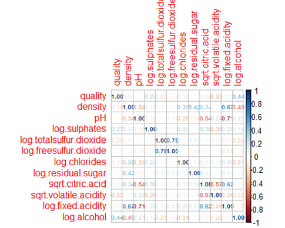
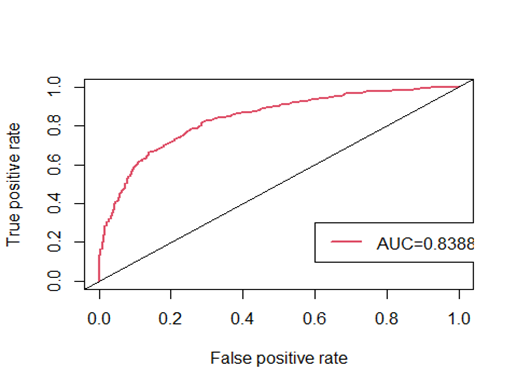
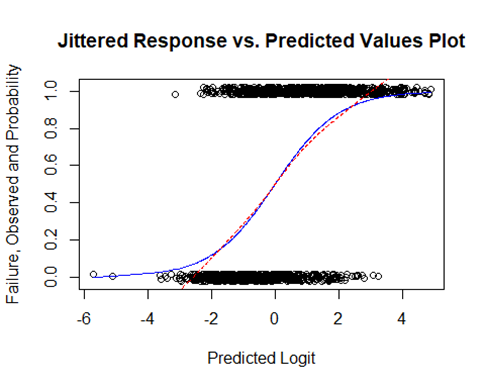
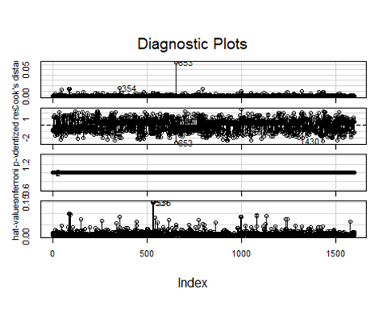
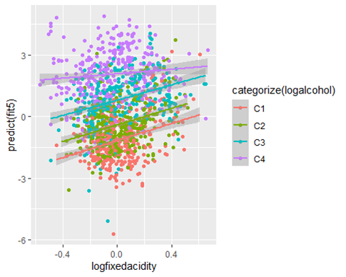
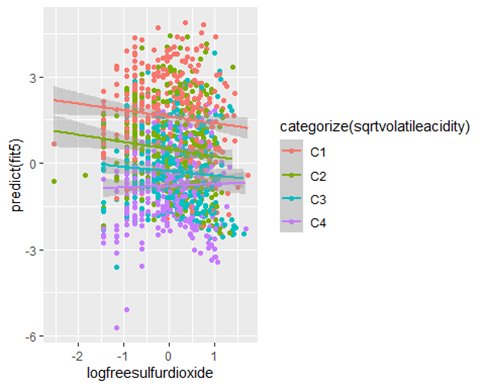

# Predicting The Quality of Vinho Verde Wine Using Physicochemical Factors

 

Badge [source](https://shields.io/)

## Key findings

Alcohol is the most significant predictor of quality wine so interestingly, wines with higher alcohol contents have higher quality. 

## Authors

- [@siyamabu](https://www.github.com/siyamabu)

**Language and Tools:** 
* R 🏴‍☠️ 
* R Studio :notebook:
* GitHub :heart_eyes:

**Modules used:** 
* vvd
* mass
* ggplot2
* tidyr
* dplyr

**Environments Used:** 
* Windows 10 🪟

## Table of Contents

  - [Motivation](#motivation)
  - [Data source](#data-source)
  - [Methods](#methods)
  - [Quick Glance at the Results](#quick-glance-at-the-results)
  - [Lessons Learned and Recommendations](#lessons-learned-and-recommendations)
  - [Limitations and What Can Be Improved](#limitations-and-what-can-be-improved)
  - [Explore the Notebook](#explore-the-notebook)
  - [License](#license)

## Motivation 

## Data Source

- [Vinho Verde Wine Quality](https://www.kaggle.com/uciml/red-wine-quality-cortez-et-al-2009)

## Dataset Description

This dataset contains one categorical response variable (High or Poor) quality wine and 12 physicochemical predictor variables. The 12 physicochemical predictor variables are: Fixed Acidity, Volatile Acidity, Citric Acid, Residual Sugar, Chlorides, Free Sulfur Dioxide, Total Sulfur Dioxide, Density, pH, Sulphates, and Alcohol. The response variable is Quality. It was originally ranked on a scale of 1-10 with 1 through 5 being wine of poor quality and 6 through 10 being wine high quality. We changed this to 1 for high quality and 0 for poor quality. There are 1599 wine variants.

## Methods

- 

## Quick Glance at the Results

Scatter Plot of final model. 

ROC Curve. 

Residual & Diagnostic Analysis of final model.

 

Jittered Response vs. Predicted Values Plot of final model. 

Diagnostic Plots of final model. 

Interaction Plot of Log Alcohol and Log Fixed Acidity. 

Interaction Plot of Square Root of Volative Acidity and Log Free Sulfur Dioxide.

 

## Lessons Learned and Recommendations

## Limitations and What Can Be Improved

## Explore the Notebook

To explore the notebook file [here](https://github.com/siyamabu/Vinho-Verde-Wine/blob/main/vinho_verde_wine.docx)

## License

MIT License

Copyright (c) 2022 Siyabonga Mabuza

Permission is hereby granted, free of charge, to any person obtaining a copy
of this software and associated documentation files (the "Software"), to deal
in the Software without restriction, including without limitation the rights
to use, copy, modify, merge, publish, distribute, sublicense, and/or sell
copies of the Software, and to permit persons to whom the Software is
furnished to do so, subject to the following conditions:

The above copyright notice and this permission notice shall be included in all
copies or substantial portions of the Software.

THE SOFTWARE IS PROVIDED "AS IS", WITHOUT WARRANTY OF ANY KIND, EXPRESS OR
IMPLIED, INCLUDING BUT NOT LIMITED TO THE WARRANTIES OF MERCHANTABILITY,
FITNESS FOR A PARTICULAR PURPOSE AND NONINFRINGEMENT. IN NO EVENT SHALL THE
AUTHORS OR COPYRIGHT HOLDERS BE LIABLE FOR ANY CLAIM, DAMAGES OR OTHER
LIABILITY, WHETHER IN AN ACTION OF CONTRACT, TORT OR OTHERWISE, ARISING FROM,
OUT OF OR IN CONNECTION WITH THE SOFTWARE OR THE USE OR OTHER DEALINGS IN THE
SOFTWARE.

Learn more about [MIT](https://choosealicense.com/licenses/mit/) license

